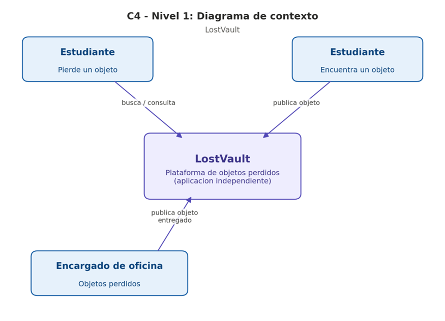

# 3. Contexto y Alcance (C4 Nivel 1)

Este documento presenta el diagrama de contexto (C4 Nivel 1) del sistema LostVault, junto con la descripción de los actores que interactúan con él y el alcance del sistema.

## 1. Alcance del sistema

LostVault es una aplicación independiente que centraliza la gestión de objetos perdidos en la universidad. No forma parte de la app oficial de la universidad ni depende de ella para funcionar: no existe integración, acoplamiento ni relación de contención entre ambos sistemas. LostVault es autónomo tanto en su operación como en sus datos.

## 2. Diagrama de contexto

## 3. Actores y relaciones

| Actor | Tipo | Relación con LostVault |
|---|---|---|
| Estudiante (pierde un objeto) | Persona | Busca y filtra objetos publicados en la plataforma; recibe visibilidad del inventario disponible sin necesidad de contactar a nadie. |
| Estudiante (encuentra un objeto) | Persona | Publica un objeto encontrado, adjuntando foto y descripción, sin pasar físicamente por la oficina. |
| Encargado de la oficina de objetos perdidos | Persona | Publica en la plataforma los objetos que le son entregados físicamente en la oficina. |

## 4. Notas

- El sistema no tiene sistemas externos en este nivel de contexto: solo interactúa con personas (interesados).
- El mismo estudiante puede ejercer ambos roles (perder y encontrar objetos) en momentos distintos; se representan por separado porque el estímulo y la respuesta del sistema son diferentes en cada caso.

## Diagrama C4

El diagrama de contexto revisable está en [docs/c4/contexto.mmd](../c4/contexto.mmd) y su representación visual en [docs/c4/c4_contexto.png](../c4/c4_contexto.png).
